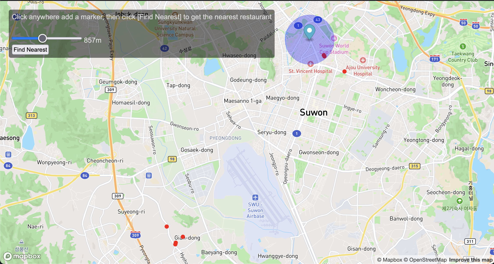
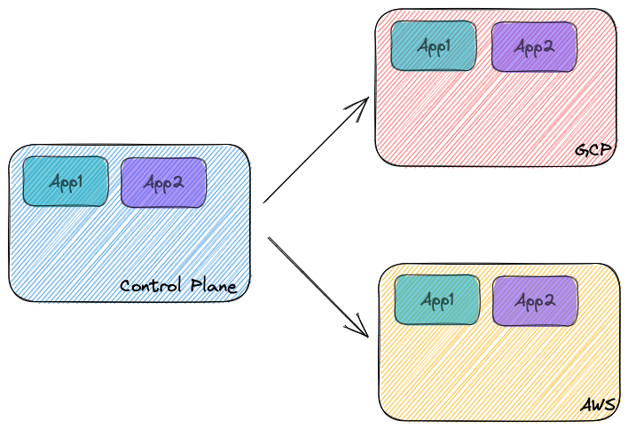
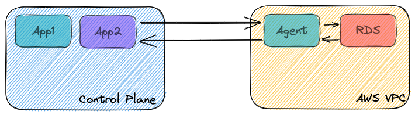

# Korean Restaurants

This is a simple app to help me find my favourite korean restaurants. I live in
Korea and I like to eat great food! This app will help me not to get hungry!

View it live here: https://korean-restaurants-x1ncq0w8e0jnm.cpln.app/ . _Be
kind, its serverless so refresh a few times to trigger the first container
coming online (I'm a starving engineer)_. Hosted on
**[Control Plane](https://controlplane.com)**



The accompanying B/E project for this is
[here](https://github.com/chrisjpalmer/korean-restaurants-be).

## Getting Started

### Requirements

- Docker
- Node JS (I used v18)
- Port 3000 & 3001 free on your machine

### Run the F/E app

```bash
git clone https://github.com/chrisjpalmer/korean-restaurants
cd korean-restaurants
npm install
npm run dev
```

### Run the B/E app

```bash
git clone https://github.com/chrisjpalmer/korean-restaurants-be
cd korean-restaurants-be
```

If you are a Makefile person:

```sh
make database
make build-docker
make serve-docker
```

If you are not a Makefile person:

```sh
./scripts/make-database.sh
./scripts/build-docker.sh
./scripts/serve-docker.sh
```

Open [http://localhost:3000](http://localhost:3000) to see the app.

## How it works

- A list of korean restaurants in geojson format is statically served to the
  F/E. These are displayed on the map when the app loads.
- To find the nearest korean restaurant to the marker point, the B/E service
  queries the postgres database which contains the same list of restaurants.

## The Brief

I read
[this article](https://www.linkedin.com/pulse/right-size-your-geospatial-data-architecture-vector-michael-asher/?utm_source=share&utm_medium=member_ios&utm_campaign=share_via)
by Michael Asher and wanted to see how quickly I could pick up a new software
stack. I have never used postgis, mapbox, ogr2ogr OR geojson before. I'm also
not a F/E developer by trade.

I came up with a simple concept, to build an app that could showcase my
favourite korean restaurants and tell me where the closest one was - this is
rather helpful as I live in Korea (at least for the next 12 months).

I spent in total 18 hours comprised of:

- 4 hours of initial research
- 4 hours on the B/E
- 8 hours on the F/E
- 2 hours of bug fixing/polishing/testing

To build this, the steps I took were.

1. Plotted my favourite korean restaurants on google earth
2. Converted the KML file to GeoJSON using ogr2ogr
3. Loaded the GeoJSON into a Postgis enabled database using ogr2ogr.
4. Tested out some queries to familiarize myself with Postgis
5. Built a simple B/E to query the database.
6. Built a basic F/E app using react + mapbox.
7. Wired up my B/E and F/E

**_Update: CI/CD with Control Plane_**

All commits after June 15 were to set up my hosting on
[Control Plane](https://controlplane.com/). The commit history is a bit of a
mess because I was just having some fun at this point.

## Stuff Learnt

- Postgis
- Mapbox
- Ogr2Ogr
- GeoJSON
- Bit more react

## Why should you hire me ?

- I am a fast learner - learnt postgis, mapbox, ogr2ogr in a few hours
- I am versatile with technical detail
- I like to GSD (get stuff done) - if you dont ship it, you don't make money.
- I am organized - comments, code organization, documentation, diagrams are part
  of my trade.

## DevSecOps

I believe DecSecOps is an important part of software development. In this
project I implemented a few good practices:

1. Sensitive data stored in github secrets.
2. Trivy image scanning before artifacts are published.
3. Dependabot enabled so if a CVE is detected in a dependency being used, GitHub
   generates a PR with the dependency update.
4. Automated CI/CD process to eliminate human error during deployment.

Ultimately to do DevSecOps properly, security needs to be in the mindset of the
organization and be part of every process in the Software Development Life Cycle
(SDLC). Here are some examples of things you could do in different stages of the
SDLC to implement DevSecOps:

**Requirements / Planning**

- Are any access controls required to keep users safe?

**Architectural Design**

- Consider impacts of architectural changes - could it be exploited?

**Development**

- Consider impacts of code to be written - could it be exploited?
- Use static analysis tools
- Write unit tests designed to break modules / exploit common attack vectors
- Artifact scanning
- Codebase scanning

**Testing**

- Write integration tests designed to break services / exploit common attack
  vectors

**Deployment**

- In-cluster artifact scanning
- Chaos testing
- Run integration tests regularly

## About Control Plane

This application was deployed with Control Plane. Control Plane allows you to
deploy containerized workloads to multiple cloud providers without having to
manage the underlying infrastructure. Under the hood Control Plane uses
kubernetes and istio. This allows an operator to define a simple definition of
their workload, and have it deployed across cloud providers. This application is
deployed across AWS and GCP clusters.



The B/E service for this application depends on a postgres database to operate.
An RDS instance was deployed to AWS, and then linked to the Control Plane
account using an _Agent_. _Agents_ allows workloads deployed to Control Plane to
consume services in another VPC or private network.


